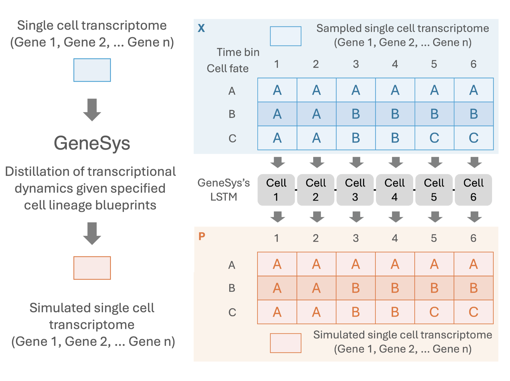
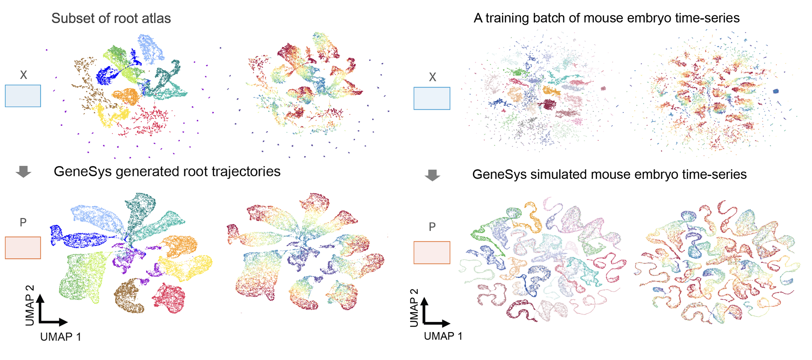

# GeneSys
**Gene**rative Regulatory Modeling for **Sys**tematic Development

---
Temporal single-cell transcriptomics enables the reconstruction of dynamic gene expression changes during development, yet its analytical power is often limited by data sparsity, technical noise, and imbalanced cell-type representation across time points. To overcome these challenges, we present GeneSys (Generative Modeling of Developmental System), a generative deep learning model that simulates single-cell transcriptomic landscapes under developmental constraints and informed by prior biological knowledge or user-defined hypotheses. GeneSys integrates a temporal variational autoencoder with a cell-type classifier and requires a lineage blueprint as input, allowing it to model the temporal transitions of transcriptional states with cell-type specificity. Leveraging data from Arabidopsis thaliana roots and mouse embryos, we show that GeneSys learns robust developmental trajectories, generates realistic and representative transcriptomes, and enhances gene prioritization accuracy compared to unregularized scRNA-seq data.

The preprint will be available by August 25, 2025, and the model will be available for easy installation via pip soon. Please stay tuned.

---

The source codes of GeneSys for training and evaluation are under the code folder.

The jupyter notebooks demonstrating how to prepare, train, and evaluate the GeneSys model can be found under jupyter_notebook folder.
