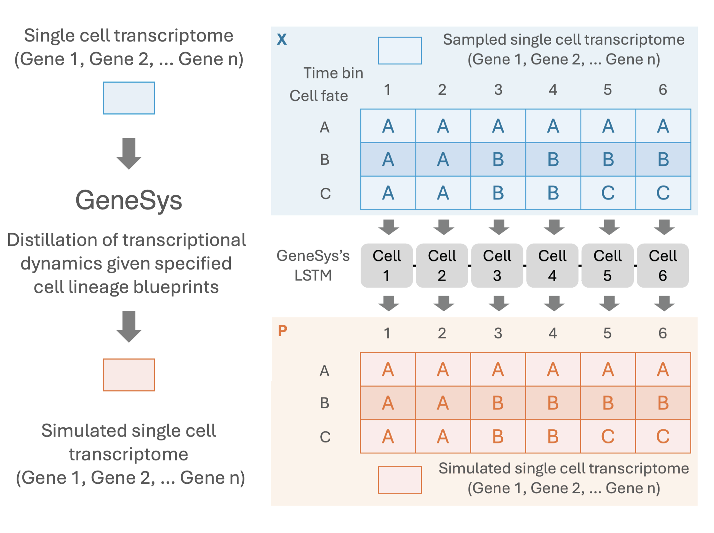
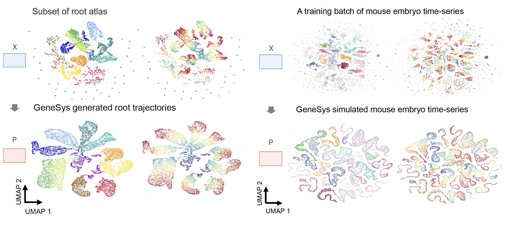
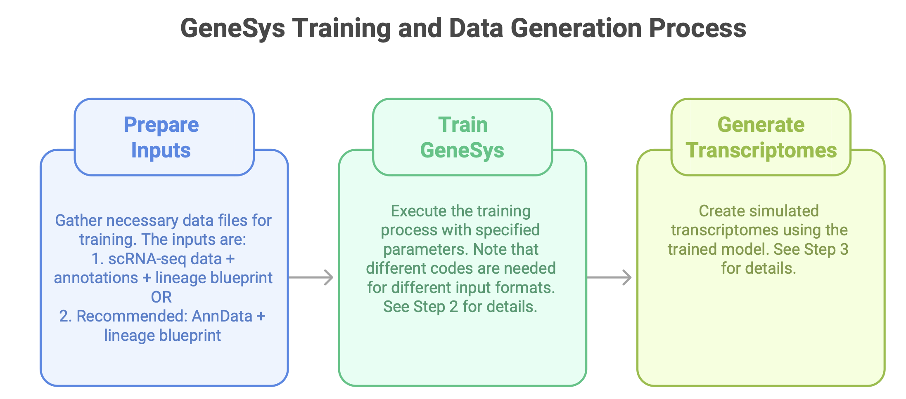

# GeneSys
**Gene**rative Modeling of Developmental **Sys**tem

---
Temporal single-cell transcriptomics enables the reconstruction of dynamic gene expression changes during development, yet its analytical power is often limited by data sparsity, technical noise, and imbalanced cell-type representation across time points. To overcome these challenges, we present GeneSys, a generative deep learning model that simulates single-cell transcriptomic landscapes under developmental constraints and informed by prior biological knowledge or user-defined hypotheses. GeneSys integrates a temporal variational autoencoder with a cell-type classifier and requires a lineage blueprint as input, allowing it to model the temporal transitions of transcriptional states with cell-type specificity. Leveraging data from Arabidopsis thaliana roots and mouse embryos, we show that GeneSys learns robust developmental trajectories, generates realistic and representative transcriptomes, and enhances gene prioritization accuracy compared to unregularized scRNA-seq data.

**Our manuscript is available on [bioRxiv](https://doi.org/10.1101/2025.08.20.671385) since August 25th, 2025.**





---

## Tutorial

**This tutorial has been stable since September 17, 2025. As a reminder, you must train the model before attempting generation. Please follow the steps in numerical order.**


### 0. Install GeneSys (Please use GPU node to install !!)
```
## Create conda environment (ignore jupyterlab if you don't use jupyter notebooks)
conda create -n genesys -c conda-forge -c anaconda jupyterlab pytorch-gpu python=3.8 -y
conda activate genesys

## Clone the github repo
git clone https://github.com/Hsu-Che-Wei/GeneSys.git

## Install Genesys
cd ./GeneSys/genesys
pip install -e .

## Go to the folder/directory where the data sets are stored
cd ../toy_data 
```

### 1. Prepare your inputs
Essentially, GeneSys requires three inputs for training: scRNA-seq data, cell annotations, and a cell lineage blueprint. A recommended alternative is to provide an annotated AnnData object together with the cell lineage blueprint. The details of each items are shown below. Example toy data can be found in [toy_data](./toy_data) folder.

**a. scRNA-seq data** (output of 10X genomics cellranger or our tool [copilot](https://github.com/Hsu-Che-Wei/COPILOT)) : 

Filtered cell-by-gene matrix (.mtx), cell barcodes (.txt), gene ids/ feature names (.txt)

**b. Cell annotations** : 

The annotation table (.txt) should include three columns named 'barcode', 'label' and 'time'. 'barcode' for the cell barcodes in the scRNA-seq data, 'label' for the categorical labels (cell types, conditions ... etc), and 'time' for temporal steps (treatment time points, dev stages, time bins), which should be in numeric order starting from 1 (e.g. 1, 2, 3, ... n).
   
**c. Cell lineage blueprint** : 

The cell lineage table (.txt) should include how each trajectory (row) is defined. How many trajectories (rows) are there? How many temporal steps (columns) are there? And how cells should be sampled based on the annotation table for each trajectory (biological knowledge or hypothesis).

**\* Alternative (recommended)**:

We encourage users to provide training data in the [AnnData](https://anndata.readthedocs.io/en/stable/) format, which includes (a) the scRNA-seq expression matrix and (b) cell annotations. The expression matrix should be stored in anndata.X, which will be scaled during training. If raw counts are provided in anndata.X, they will first be log-normalized before scaling. Cell annotations should be stored in anndata.obs under the metadata columns named "label" and "time".

### 2. Train GeneSys
The estimated running time for toy data is ~10 mins on one NVIDIA P100 GPU. Less training time is expected when trained on more advanced GPUs. Select the relevant section of the code below according to your input format. The output includes the trained model (.pth) and the training log (.pdf)

**Raw RNA counts cell-by-gene matrix** : 

Raw RNA counts will be log-normalized and scaled for training.

```
## Provide --anndata with directory to where matrix.mtx barcodes.tsv genes.tsv is stored
genesys --train --raw_counts --anndata ./cell_by_gene_matrix/ --anno ./annotations.txt --bprint ./lineage.txt --epochs 30 --batch_size 128 --verbose 
```

**AnnData as the input (recommended)** : 

```
## RNA counts
genesys --train --raw_counts --anndata ./Root_Atlas_RNA_downsampled_2400_cells.h5ad --bprint ./lineage.txt --epochs 30 --batch_size 128 --verbose

## Normalized and/or corrected values
## Noticed that Root_Atlas_SCT_downsampled_2400_cells.h5ad is not provided in the toy_data, this is just an example of how such data can be used to train GeneSys.
#genesys --train --anndata ./Root_Atlas_SCT_downsampled_2400_cells.h5ad --bprint ./lineage.txt --epochs 30 --batch_size 128 --verbose
```

### 3. GeneSys-generated transcriptomes (P)

CPU nodes are recommended here as the RAM availability and capacity to handle large data are usually higher. Select the relevant section of the code below according to your input format. The output includes the generated data in anndata format (.h5ad).

**Raw RNA counts cell-by-gene matrix** :
```
## Cell-by-gene matrix
genesys --anndata ./cell_by_gene_matrix/ --anno ./annotations.txt --bprint ./lineage.txt --batch_size 128 --verbose --device "cpu" --save_prefix "Root_Atlas_RNA_downsampled_2400_cells"
```

**AnnData as the input (recommended)** :
```
## Anndata
genesys --anndata ./Root_Atlas_RNA_downsampled_2400_cells.h5ad --bprint ./lineage.txt --batch_size 128 --verbose --device "cpu" --save_prefix "Root_Atlas_RNA_downsampled_2400_cells"
```

### 4. Real-world applications (i.e., your own data)

The toy data examples with 2,400 cells shown in sections 2 and 3 are provided only as a sanity check. In real-world applications, a dataset of 2,400 cells is not sufficient to train a meaningful GeneSys model. We recommend using at least 20k - 30k cells to effectively try out GeneSys.   

```
## Train
## Notice that Root_Atlas_SCT_downsampled_30000_cells.h5ad is not provided, this is just an example of real-world applications.
genesys --train --raw_counts --anndata ./Root_Atlas_RNA_downsampled_30000_cells.h5ad --bprint ./lineage.txt --epochs 100 --batch_size 512 --verbose

## Generate
## Noticed that Root_Atlas_SCT_downsampled_30000_cells.h5ad is not provided, this is just an example of real-world applications.
genesys --anndata ./Root_Atlas_RNA_downsampled_30000_cells.h5ad --bprint ./lineage.txt --batch_size 512 --verbose --device "cpu" --save_prefix "Root_Atlas_RNA_downsampled_30000_cells"
```

### 5. Install GeneSys multi-GPU version for large data or shorter training time (Number of cells >= 50 k)
```
## Create conda environment (ignore jupyterlab if you don't use jupyter notebooks)
conda create -n genesys -c conda-forge -c anaconda jupyterlab pytorch-gpu python=3.8 -y
conda activate genesys

## Clone the github repo
git clone https://github.com/Hsu-Che-Wei/GeneSys.git

## Install Genesys
cd ./GeneSys/genesys
pip install -e .

## Install Genesys Multi-GPU
cd ./GeneSys/genesys_multi_gpu
pip install -e .

## Go to the folder/directory where the your data sets are stored
cd ../your_data_set 
```

### 6. Prepare, train, and generate with GeneSys multi-GPU
```
## Prepare training data (require large memory for large data)
genesys --prepare_train --raw_counts --anndata ./Root_Atlas_RNA_downsampled_100000_cells.h5ad --bprint ./lineage.txt --epochs 100 --batch_size 512 --verbose --path ./root_100k_ckpt

## Train
#See job_genesys_multi_gpu_train.q
sbatch job_genesys_multi_gpu_train.q

## Generate
genesys --anndata ./Root_Atlas_RNA_downsampled_100000_cells.h5ad --bprint ./lineage.txt --batch_size 512 --verbose --device "cpu" --save_prefix "Root_Atlas_RNA_downsampled_100000_cells_multi_gpu" --path ./root_100k_ckpt
```

### Parameters Glossary

| Parameter       | Description |
|-----------------|-------------|
| `--anndata`     | Path to anndata (.h5ad) or cell-by-gene matrices. |
| `--bprint`      | Path to cell lineage blueprint (lineage.txt). |
| `--anno`        | Path to annotation file (annotation.txt). |
| `--train`       | Flag: run training. Remove this flag to run generation. |
| `--raw_counts`  | Flag: input is raw RNA counts. Remove for normalized/corrected values. |
| `--epochs`      | Number of training epochs per training cycle. Default=100.|
| `--max_cycles`  | Maximum number of training cycles. Default=20.|
| `--batch_size`  | Number of trajectories trained/generated per batch. Default = 512.|
| `--lr`          | Starting learning rate for training. Default=1e-3.|
| `--patience`    | How many epochs with no improvement in the monitored metric (e.g., validation loss) to wait before reducing the learning rate.<br>**Example:** With `patience=10`, the scheduler waits 10 epochs after the last improvement before lowering the learning rate. Default=10.|
| `--factor`      | Multiplicative factor to reduce the learning rate when triggered.<br>**Example:** With `factor=0.5` and current learning rate = 1e-3, it will drop to 5e-4 after patience runs out. Typical values: 0.1 or 0.5. Default=0.5.|
| `--threshold`   | Minimum significant change in the monitored metric to qualify as an "improvement." Changes smaller than this are ignored.<br>**Example:** With `threshold=0.05`, a validation loss drop from 1.000 → 0.995 (0.5%) does **not** count; you’d need at least a 5% relative drop. Default=0.05.|
| `--path`        | Path to where the model checkpoints, training logs and intermediate files are stored. Default="./checkpoints".|
| `--save_prefix` | Prefix for the GeneSys-generated transcriptomes. Default="Data_Set_1".|
| `--device`      | GPU (`"cuda"`) or CPU (`"cpu"`) to use for training and generation. Default = "cuda" if available.|
| `--verbose`     | Flag: print real-time running information. Remove this flag to silence. |

---

## For those comfortable with raw Python code and interested in the intricacies of the development process

The source codes used for the GeneSys manuscript are under the code folder.

The jupyter notebooks demonstrating how to prepare, train, and evaluate the GeneSys model can be found under jupyter_notebook folder.


